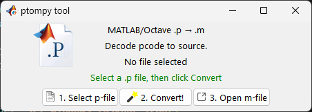

# PtoMpy

Python tkinter GUI tool for Windows. Converts MATLAB `.p` (p-code) files to `.m` source. Uses Nuitka to build a standalone executable.

## About: how .p files are generated

`.p` files are created in MATLAB with the `pcode` function. Example: `pcode('myfunc')` reads `myfunc.m` and writes `myfunc.p`. PtoMpy does the reverse: decodes `.p` back to readable `.m`.


## Screenshot



## Example: .p → .m

- **`.p`** — MATLAB p-code (compiled/obfuscated, binary). You can’t read or edit it.
- **`.m`** — MATLAB source (plain text). PtoMpy decodes a `.p` file and writes the equivalent `.m` source.

**Input:** `example.p` (binary p-code)  
**Output:** `example.m` (readable source), e.g.:

```matlab
x = -2 * pi:1/10 * pi:2 * pi;
y1 = sin(x);
y2 = cos(x);
subplot(2, 2, 1); plot(x, y1, 'r-');
subplot(2, 2, 2); plot(x, y2, 'g-');
% ... rest of decoded script
```

*(Snippet from `examples/myplot.m`; run PtoMpy on `examples/example.p` or `examples/myplot.p` to get full `.m` output.)*


## Run

- **GUI:** `python main.py` — pick a `.p` file, convert, open the `.m` in Notepad.
- **TUI:** `python main.py path/to/file.p` — convert from command line.

## Build (Windows)

```bash
pip install -r requirements.txt
python build_nuitka.py
```

Output: `build/` with `ptompy.exe`.

### Setup installer (optional)

To create a Windows setup.exe for distribution:

1. Build the standalone (see above).
2. Install [Inno Setup 6](https://jrsoftware.org/isdl.php).
3. Run: `python build_setup.py`

Output: `build/PtoMpy_Setup_0.2.exe` (or run `iscc setup.iss` manually).

## Requirements

- Python 3.x
- Pillow (GUI); Nuitka + Pillow for building

See `requirements.txt`.
